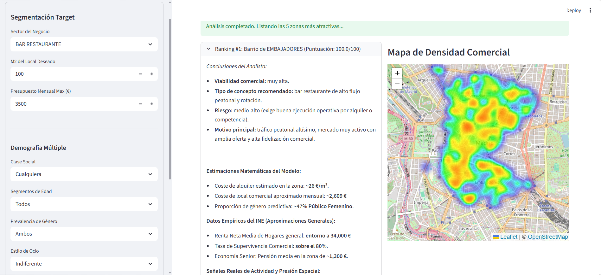

# Inteligencia Inmobiliaria y Comercial (Madrid) - V4

Este proyecto es una plataforma interactiva que actúa como un **Analista de Inversiones Inmobiliarias y Comerciales** para la ciudad de Madrid. 

A diferencia de los modelos basados en intuición o aproximaciones matemáticas (heurísticas), este recomendador se fundamenta al 100% en **datos oficiales cruzados de la comunidad de Madrid**, recogiendo variables directas de portales inmobiliarios, flujos peatonales del Ayuntamiento, presión turística (Airbnb VUTs) e indicadores económicos oficiales (Rentas, Pensiones y Tasas de Supervivencia publicadas por el INE y Urban Audit).

![Demostración de Mapa de Calor de Folium en Streamlit] 

## Funcionalidades Clave
1. **Filtros Inversores Estrictos:** Localiza un nicho filtrando por Tamaño del Local (m²), Presupuesto Máximo, Clase Social objetivo, Rango de Edad, Perfil Femenino/Masculino y Estilo de Ocio (Nocturno vs Diurno).
2. **Ocupación Turística:** Prioriza barrios que tienen saturación alta o baja de Viviendas de Uso Turístico (VUTs).
3. **Tránsito Peatonal:** Descarta locales en zonas sin tránsito documentado usando sensores reales de aforo cruzados del Ayuntamiento de Madrid.
4. **Análisis Cualitativo Dinámico:** Devuelve "conclusiones de analista" generadas por el sistema (evalúa Riesgo, Tipo de Concepto y Motivos), evitando falsa precisión numérica o ceros técnicos confusos.
5. **Mapa de Densidad Espacial (Heatmap):** Renderizado interactivo sobre Folium centrado estáticamente en Madrid, dibujando la concentración térmica de competidores para identificar sectores saturados o zonas Océano Azul.

## Datasets Oficiales e Ingesta de Datos
Todo el proceso analítico interactúa con distintas bases de datos públicas de Madrid Open Data, Padrones Municipales e Institutos de Inversión y Estadística. Puedes descargar los archivos listados para re-ejecutar el ETL con tu propia ruta de origen:

### 1. Estado y Tejido Comercial
Describe las licencias comerciales vigentes, los locales y el volumen de terrazas hosteleras espacializadas en la ciudad.
- **Censo de Locales y Actividades:** (https://datos.madrid.es/dataset/200085-0-censo-locales/downloads)
- **Censo de Terrazas de Hostelería:** (https://datos.madrid.es/dataset/200085-0-censo-locales/downloads?hierarchy=Censo-de-locales-y-sus-actividades-Terrazas)

### 2. Flujos Espaciales y Turísticos (Calor y Tránsito)
Determinan agrupaciones de personas e itinerancias del consumidor mediante geolocalización y sensores callejeros. 
- **Flujo y Aforo Peatonal de Madrid (Sensores IoT):** (https://datos.madrid.es/dataset/300321-0-aforos-peatones-bicicletas/downloads?hierarchy=2024-Peatones)
- **Listado Oficial de Viviendas de Uso Turístico (VUTs Airbnbs):** (https://geoportal.madrid.es/IDEAM_WBGEOPORTAL/dataset.iam?id=efa31be4-1439-11ef-a86b-3024a94b329d)

### 3. Demografía y Variables Económicas (Renta y Pensiones)
Desplazan las aproximaciones estocásticas calculando el estatus real social por distrito en volumen demográfico, rentas netas e indicadores de viabilidad corporativa.
- **Padrón Municipal de Habitantes (Edades y Géneros):** (https://datos.madrid.es/dataset/200076-0-padron/downloads?hierarchy=Padron-Poblacion-residente-en-el-municipio)
- **Histórico Cuadros de Precios de Alquiler Inmobiliario (€/m²):** (https://servpub.madrid.es/CSEBD_WBINTER/seleccionSerie.html?numSerie=0504030000214)
- **Panel de Indicadores Económicos Generales (Urban Audit y Tasa de Supervivencia):** (https://data.europa.eu/data/datasets/https-datos-madrid-es-egob-catalogo-300087-0-indicadores-distritos?locale=es)

## Arquitectura de Datos (Pipeline ETL)
El proyecto procesa la estructuración de la información mediante módulos documentados (Jupyter Notebooks) de limpieza y cruce:
* **Fases 01 y 02:** Ingesta de padrones, licencias vigentes, filtrado de epígrafes y limpieza textual de descripciones de zonas y distritos.
* **Fase 03:** Integración del mapeo empírico flotante (Sensores peatonales y Densidad de la Vivienda de uso Turístico).
* **Fase 04:** Unificación del padrón moderno y el cruce micro-zonal de la estimación del mercado inmobiliario y precios vigentes.
* **Fase 05:** Ingesta del panel multivariante económico (Ingresos Netos Totales y Ratio de Locales Abiertos vs Cerrados).
* **Consolidación Vectorial:** Archivo CSV maestro exportado a la carpeta procesada listo para su cálculo en tiempo real en la UI (`data/processed/negocios_scored.csv`).

## Instalación y Despliegue Local

1. **Clonar repositorio:**
    ```bash
    git clone https://github.com/DRO98/madrid-inteligencia-comercial.git
    cd madrid-inteligencia-comercial
    ```

2. **Crear y activar el entorno virtual. Instalar paquetes referenciados:**
   * **En Windows:**
     ```bash
     python -m venv .venv
     .venv\Scripts\activate
     pip install -r requirements.txt
     ```
   * **En macOS/Linux:**
     ```bash
     python3 -m venv .venv
     source .venv/bin/activate
     pip install -r requirements.txt
     ```

3. **Inicializar Visualizador Streamlit:**
   ```bash
   streamlit run app.py
   ```
   *(La interfaz levantará en el navegador por defecto en servidor de loopback, puerto 8503 u 8501).*

## Organización de Código Interno
* `app.py`: Módulo principal del Dashboard y configuración del backend de Streamlit / Folium map provider.
* `util_text.py`: Intérprete semántico de informes para formular explicaciones del modelo al usuario final.
* `src/features/recommender.py`: Motor central algorítmico y cálculo determinista (Score Inversión Final y cruces paramétricos).
* `notebooks/`: Cuadernos Python formativos del proceso ETL.
* `data/processed/negocios_scored.csv`: Estructura de producción precalentada en memoria RAM.

---

